# Installing R and RStudio

Please complete this setup **before the first session** so we can spend workshop time on R, not on installation. It takes about 15 minutes.

You need to install two free programs, **in this order**:

1. **R** – the programming language itself
2. **RStudio Desktop** – the editor we will use to write and run R code

> **Note:** R and RStudio release new versions regularly, so the version numbers on your screen will not match the screenshots exactly. That is fine – choose the newest version offered.

**Jump to:** [Windows](#windows) · [macOS](#macos) · [Check that it works](#check-that-it-works) · [Troubleshooting](#troubleshooting) · [Can't install software?](#cant-install-software-use-posit-cloud)

---

## Before you start

- You need a computer where you can install software. If your laptop is managed by your institution and blocks installs, skip ahead to [Can't install software?](#cant-install-software-use-posit-cloud).
- Have an internet connection and roughly 1 GB of free disk space.

---

## Windows

### Part 1: Install R

1. Go to **<https://cloud.r-project.org/>**

   <!-- SCREENSHOT: CRAN home page with the "Download R for Windows" link visible -->
   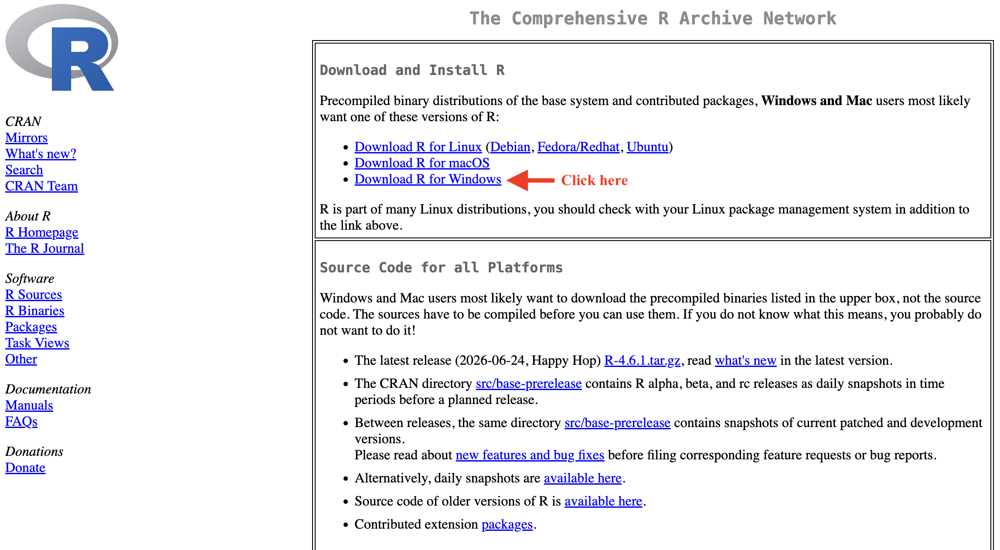

2. Click **Download R for Windows**.

3. Click **base** (also labeled "install R for the first time").

   <!-- SCREENSHOT: the "R for Windows" page showing the "base" link -->
   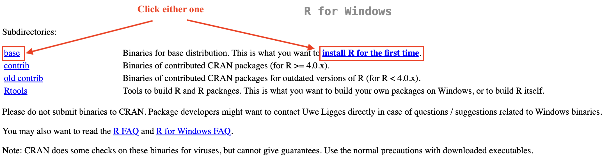

4. Click **Download R x.y.z for Windows**. (The numbers will differ.) The installer file will download.

   <!-- SCREENSHOT: the base page with the "Download R x.y.z for Windows" link at the top -->
   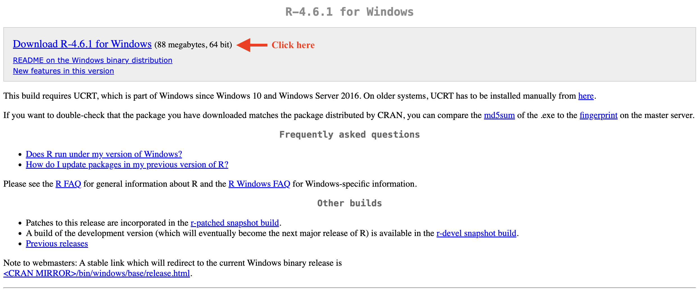

5. Open the downloaded file (it ends in `.exe`). If Windows asks whether to allow changes, click **Yes**.

6. Click **Next** through the setup screens, **keeping all the default options**, then click **Finish**.

   <!-- SCREENSHOT: the R setup wizard, e.g. the "Select Components" or "Ready to install" screen -->
   

### Part 2: Install RStudio Desktop

1. Go to **<https://posit.co/download/rstudio-desktop/>**

2. Make sure R is already installed (Part 1), then click **Download RStudio Desktop for Windows**.

   <!-- SCREENSHOT: the Posit RStudio Desktop download page with the Windows download button highlighted -->
   

3. Open the downloaded file (it ends in `.exe`), click **Next** through the setup screens with all the default options, then click **Install** and **Finish**.

   <!-- SCREENSHOT: the RStudio setup wizard on Windows -->
   

4. Open **RStudio** from the Start menu, then continue to [Check that it works](#check-that-it-works).

   <!-- SCREENSHOT: the Windows Start menu with RStudio in the search box or app list -->
   

---

## macOS

### Step 0: Find out which kind of Mac you have

You need to know this to pick the right R installer.

1. Click the **Apple menu** () in the top-left corner and choose **About This Mac**.
2. Look at the **Chip** or **Processor** line:
   - **Apple M1, M2, M3, M4 (or similar)** → you have **Apple silicon**
   - **Intel** → you have an **Intel** Mac

<!-- SCREENSHOT: the "About This Mac" window showing the Chip or Processor line -->
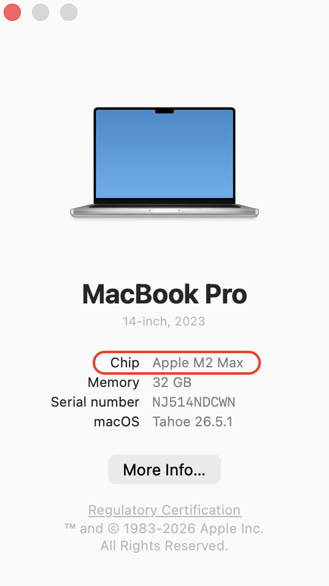

### Part 1: Install R

1. Go to **<https://cloud.r-project.org/>**

   <!-- SCREENSHOT: CRAN home page with the "Download R for macOS" link visible -->
   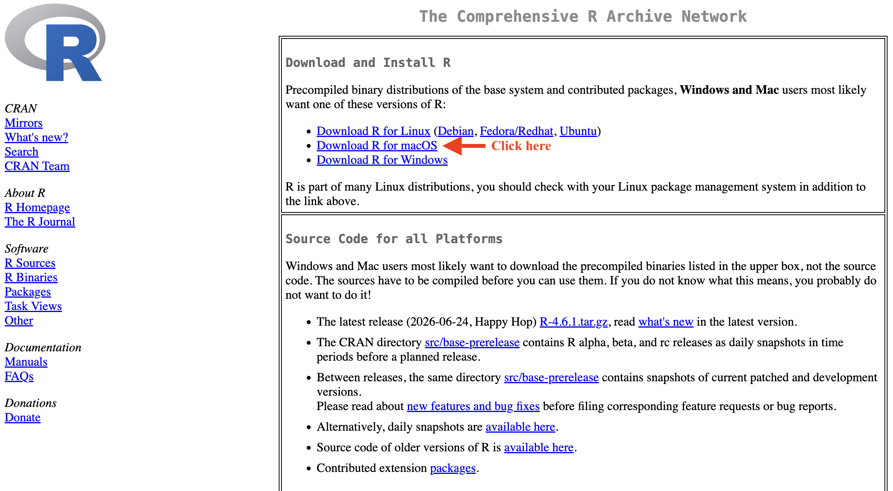

2. Click **Download R for macOS**.

3. Under **Latest release**, click the `.pkg` file that matches your Mac:
   - Apple silicon: the file with **arm64** in its name
   - Intel: the file with **x86_64** in its name

   <!-- SCREENSHOT: the "R for macOS" page with the arm64 and x86_64 .pkg links visible -->
   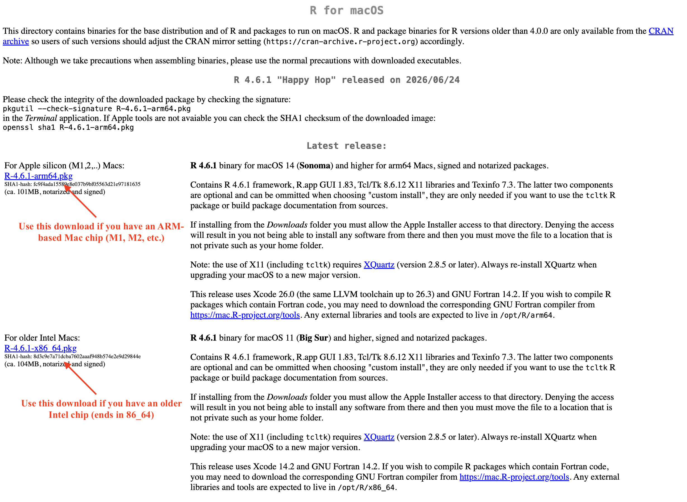

4. Open the downloaded `.pkg` file and click **Continue** / **Install** through the setup screens, accepting the defaults. Enter your Mac password if asked.

   <!-- SCREENSHOT: the R macOS installer window -->
   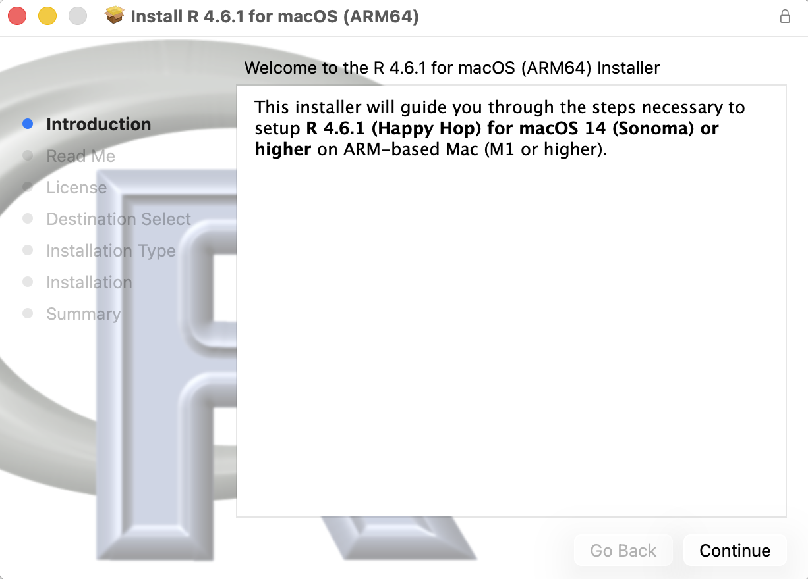

5. When it finishes, macOS may offer to move the installer to the Trash. That is fine – it only removes the installer file, not R.

### Part 2: Install RStudio Desktop

1. Go to **<https://posit.co/download/rstudio-desktop/>**

2. Make sure R is already installed (Part 1), then click **Download RStudio Desktop for macOS**.

   <!-- SCREENSHOT: the Posit RStudio Desktop download page with the macOS download button highlighted -->
   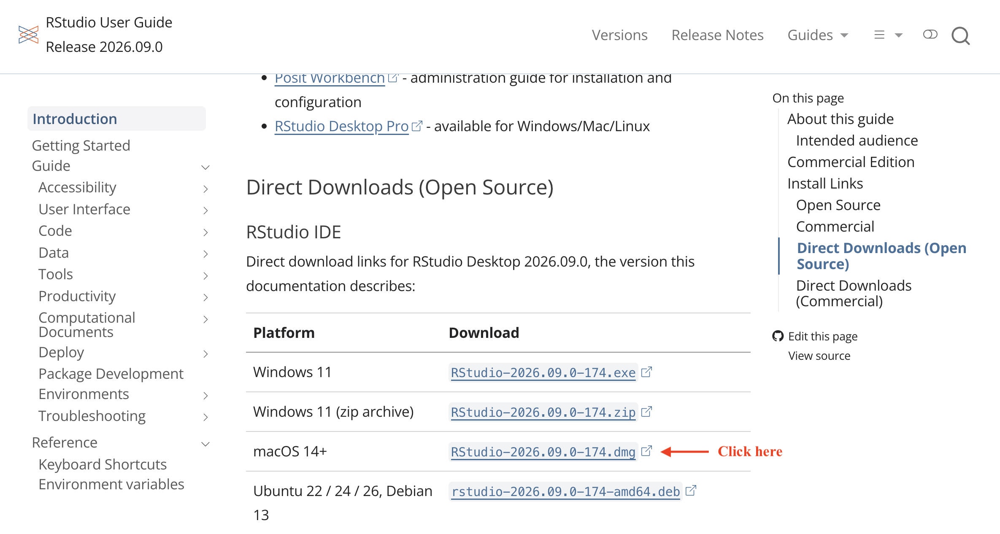

3. Open the downloaded `.dmg` file. **Drag the RStudio icon into the Applications folder** in the window that appears.

   <!-- SCREENSHOT: the RStudio .dmg window showing the RStudio icon and the Applications folder shortcut -->
   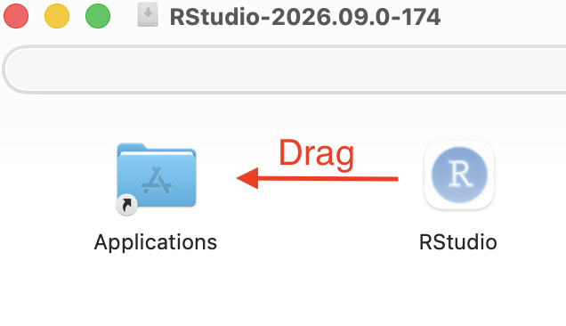

4. Open **RStudio** from your Applications folder (or Launchpad). If macOS asks whether you are sure you want to open an app downloaded from the internet, click **Open**. Then continue to [Check that it works](#check-that-it-works).

   <!-- SCREENSHOT: the macOS Applications folder or Launchpad showing RStudio -->
   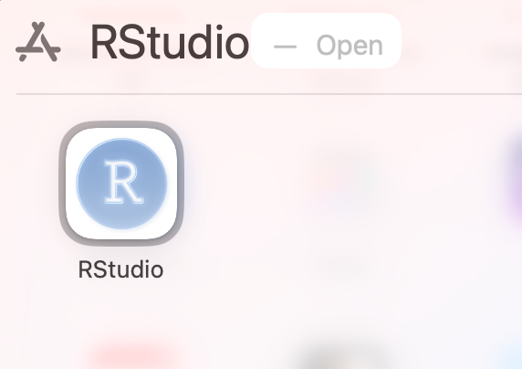

---

## Check that it works

When RStudio opens, you should see a window with several panels. The **Console** panel starts with a message that includes the R version number, followed by a `>` prompt.

<!-- SCREENSHOT: RStudio on first launch, with the Console showing the R version banner and the > prompt -->
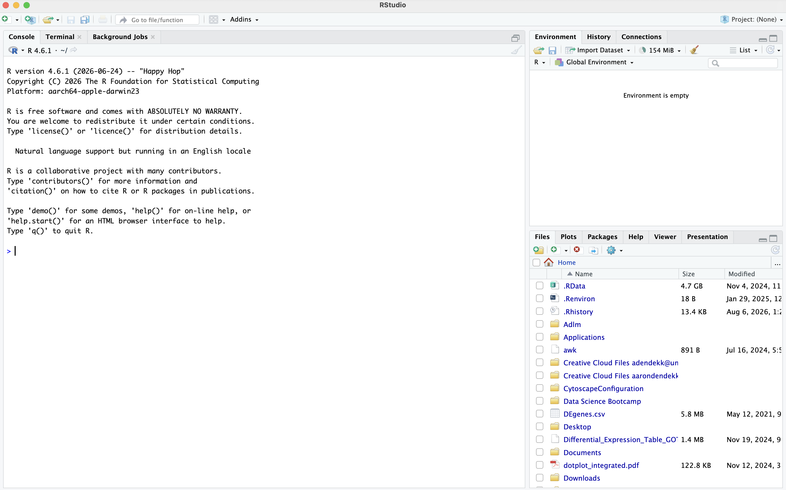

Click in the Console, type the following, and press **Enter**:

```r
1 + 1
```

You should see:

```
[1] 2
```

<!-- SCREENSHOT: the Console after typing 1 + 1 and pressing Enter, showing [1] 2 -->
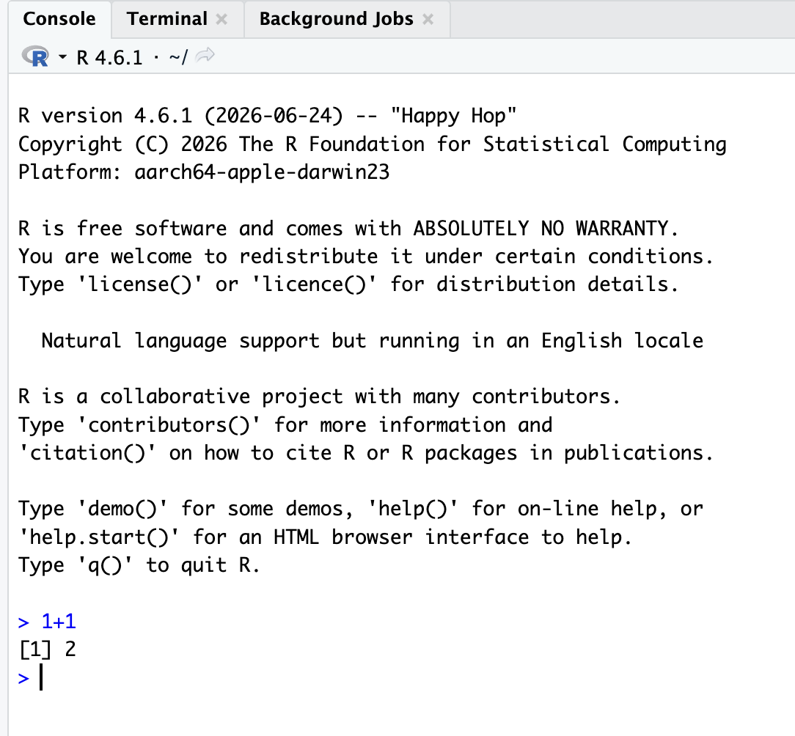

If you see that, you are ready for the workshop. 🎉

<!-- EDIT: optional. List the packages your sessions rely on so learners can install them ahead of time. -->
### Optional: install packages ahead of time

If you want a head start, run this in the Console. It can take several minutes, so it is fine to skip and do it together in the workshop.

```r
install.packages("tidyverse")
```

---

## Troubleshooting

**RStudio says it can't find R, or shows an error on startup.**
R is probably missing or was installed after RStudio was opened. Install R (Part 1), then close and reopen RStudio.

**(Windows) The installer says I need administrator permission.**
Your computer is probably managed by your institution. Ask your IT department to install R and RStudio, or use [Posit Cloud](#cant-install-software-use-posit-cloud).

**(Windows) My Documents folder is synced with OneDrive.**
This is usually fine, but it can occasionally cause problems when R installs add-on packages. If you hit strange errors installing packages, let us know at the workshop.

**(Mac) I installed the wrong R installer (Intel vs. Apple silicon).**
Go back to [Step 0](#step-0-find-out-which-kind-of-mac-you-have), download the correct `.pkg`, and run it. It will replace the earlier install.

**(Mac) macOS says an app "can't be opened because it is from an unidentified developer."**
Open **System Settings → Privacy & Security**, scroll down, and click **Open Anyway** next to the app's name. (On older macOS versions, right-click the app and choose **Open**.)

**Still stuck?**
Bring your laptop to the workshop about 15 minutes early and we will help you. You can also [open an issue](../../issues) in this repository or email [EDIT: your contact email].

---

## Can't install software? Use Posit Cloud

If you cannot install software on your computer, you can run RStudio in your web browser using **Posit Cloud**: <https://posit.cloud/>

1. Click **Get Started** and create a free account.
2. Choose the free plan. (It has limited monthly usage, which is enough for getting started.)
3. Create a new **RStudio Project**. You will get the same RStudio interface, running online.

<!-- SCREENSHOT: optional. Posit Cloud with a new RStudio project open -->

